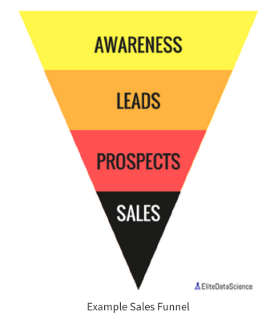

# LeadGeneration
Lead generation is a challenge that businesses have faced since the dawn of capitalism.  

# Background

To understand lead generation, let's first introduce the idea of a "sales funnel."

A sales funnel is simply a series of expected steps that a prospect undergoes before buying. Most businesses require sales funnels because visitors are not ready to become customers right away. 

# Objectives
For this challenge, a "conversion" is defined as a visitor who became a lead. 

* First, determine which sources/countries/devices had the highest conversion rates.
* Next, build a model that can predict conversion rate based on visitor information.
* What insights can you draw from your model? Which features were the most impactful?
* Finally, provide actionable insights to the business. What have we learned from this campaign? 

## How to Use
The Installation process will get you a copy of the project up and running on your local machine for development and testing purposes
1. Clone or download the project into your local machine.
2. Unzip the project folder.
3. Open the source file [Lead Generation](LeadGeneration.ipynb) using [JypyterNotebook](http://jupyter.org/) and execute the file.

## Repository Contains
 - Data -- Contains the raw data folder
 - Images -- Folder contains the images used in python notebook 
 - Problem Statement -- Case Study Business Problem Statement

If there are any issues in the code, raise them [here](https://github.com/Niranjankumar-c/LeadGeneration/issues)

## Author
- Connect with me on [linkedin](https://www.linkedin.com/in/niranjankumar-c/).
- Follow me on medium for blogs related to machine learning & deeplearning: 
    - https://towardsdatascience.com/@niranjankumarc
    - https://hackernoon.com/@niranjankumarc

### License
The code and files in this repository is made available for free released under [MIT](LICENSE).
